<!-- ====================================================================== -->
<!--  Profile README — Eron Belarmino                                       -->
<!--  Lines marked with TODO still need your input before publishing.       -->
<!-- ====================================================================== -->

  

  <!-- TODO: replace YOUR-LINKEDIN-HANDLE with the end of your LinkedIn URL -->
  
  
  

## 👋 About me

Hi, I'm **Eron** — a 23-year-old developer from Campinas, Brazil, who likes building things end to end: from the database schema and the data pipeline all the way to the API, the app and the dashboard someone opens every morning.

I have **4+ years of hands-on experience** across full-stack development and data engineering, including consulting projects for **Hospital Israelita Albert Einstein** and work at **Cogna Educação**, one of Brazil's largest education groups. I've shipped React Native apps and Node.js APIs, migrated large volumes of data into BigQuery, and automated pipelines with Apache Airflow on AWS.

Today I'm pursuing a **B.S. in Software Engineering** and focusing on what I enjoy most: clean code, resilient architecture and software that connects technical decisions to real business results.

- 🔭 **Currently:** studying Software Engineering at Universidade Anhanguera (2026 – 2029)
- 💬 **Ask me about:** React & React Native, Node.js, Python, ETL pipelines, Airflow, BigQuery, Power BI
- 🤝 **Open to:** software engineering and data engineering opportunities
- 🌎 **Languages:** Portuguese (native) · English (advanced) · Spanish (intermediate)
<!-- TODO: add what you're learning / building right now, e.g.
- 🌱 **Learning:** TypeScript, system design and automated testing
-->
<!-- TODO: add 2–3 fun facts or hobbies, e.g.
- ⚡ **Fun fact:** ...
-->

## 🧰 Tech stack

<table>
  <tr>
    <td><b>Languages &amp; frameworks</b></td>
    <td>
      
    </td>
  </tr>
  <tr>
    <td><b>Cloud &amp; databases</b></td>
    <td>
       
      
      
    </td>
  </tr>
  <tr>
    <td><b>Data &amp; automation</b></td>
    <td>
      
      
      
      
      
      
    </td>
  </tr>
</table>

## 💼 Experience

**Data &amp; Integration Analyst** · Eagles · Oct 2023 – Aug 2024 
Built and orchestrated ETL and integration pipelines with Pentaho Data Integration, keeping transactional data flows reliable. Modeled SQL Server queries and Power BI dashboards to support management decisions.

**Data &amp; Systems Analyst** · Cogna Educação · Jun 2023 – Sep 2023 
Implemented Microsoft SharePoint solutions to centralize document management. Built Power BI dashboards that turned large volumes of educational data into actionable KPIs.

**Data Analyst** · ACT Digital, for Hospital Israelita Albert Einstein · Dec 2022 – May 2023 
Consolidated MongoDB, Firebase and MySQL sources and migrated large data volumes to Google BigQuery. Automated recurring extractions with Apache Airflow on AWS and built executive dashboards in Looker Studio and Power BI.

**Full-Stack Developer** · Mirante, for Hospital Israelita Albert Einstein · Feb 2022 – Dec 2022 
Designed and built hybrid mobile apps with React Native, and architected routes, integrations and scalable APIs with Node.js in agile, multidisciplinary teams.

**Software Development Intern** · Venturus · Aug 2020 – Feb 2022 
Supported the development and maintenance of systems in Java, Kotlin and Python, helping keep code quality high across corporate projects and legacy architectures.

Earlier: full-stack web development intern at Faculdades Integradas IPEP (2018 – 2019) — PHP, JavaScript, HTML/CSS.

<!-- TODO (optional): feature 2–3 projects here once they're public, e.g.
## 🚀 Featured projects

| Project | What it does | Stack |
|---|---|---|
| [project-name](https://github.com/USERNAME/project-name) | One-line description | React · Node.js |
-->

## 📊 GitHub stats

  <picture>
    <source media="(prefers-color-scheme: dark)" srcset="./profile/stats-dark.svg" />
    
  </picture>
  <picture>
    <source media="(prefers-color-scheme: dark)" srcset="./profile/top-langs-dark.svg" />
    
  </picture>

  <picture>
    <source media="(prefers-color-scheme: dark)" srcset="./profile/snake-dark.svg" />
    
  </picture>

## 🎓 Education

- **B.S. in Software Engineering** — Universidade Anhanguera · 2026 – 2029 (in progress)
- **Computer Science** — Universidade Cruzeiro do Sul · completed 7 semesters
- **IT Technician** — Colégio Politécnico Bento Quirino · 2019

---

  Thanks for stopping by! If you'd like to talk about software, data or an opportunity, my inbox is open. 🚀

